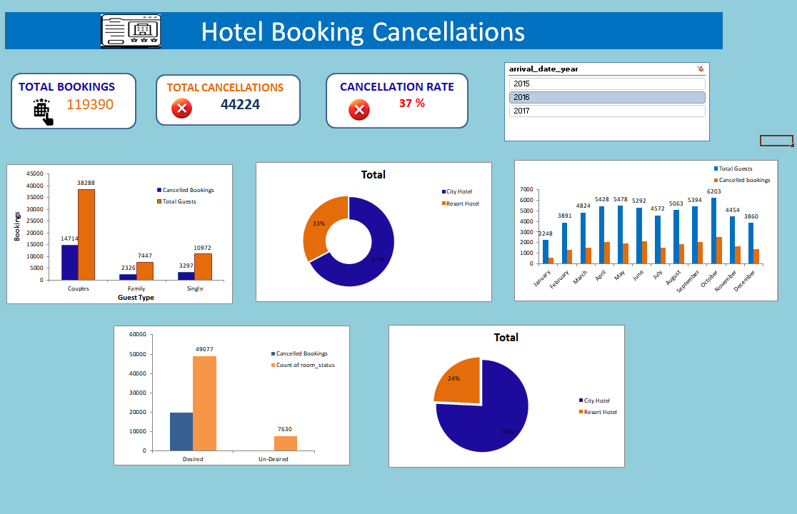

# hotel-booking-cancellation-analysis
Hotel Booking Cancellation Analysis using Microsoft Excel, Pivot Tables and DashBoard

## Project Overview

This project analyzes hotel booking data to understand booking patterns and cancellation behavior using Microsoft Excel.

## Tools Used

- Microsoft Excel
- PivotTables
- PivotCharts
- Excel Dashboard
- Data Analysis
- Data Visualization

## KPIs

- Total Bookings
- Total Cancellations
- Cancellation Rate
- Average Lead Time
- Average Daily Rate

## Analysis Performed

- Cancellation analysis by guest type
- Hotel type analysis
- Monthly booking and cancellation trends
- Room status analysis
- Booking distribution analysis
- KPI analysis

## Dashboard

## Key Insights

- Analyzed cancellation patterns across different guest types.
- Compared booking distribution between hotel types.
- Analyzed monthly booking and cancellation trends.
- Compared room-status categories.
- Calculated the overall cancellation rate.

## Project Files

- Hotel_Booking_Cancellation.xlsx - Excel analysis and dashboard
- Dashboard.png - Final dashboard
